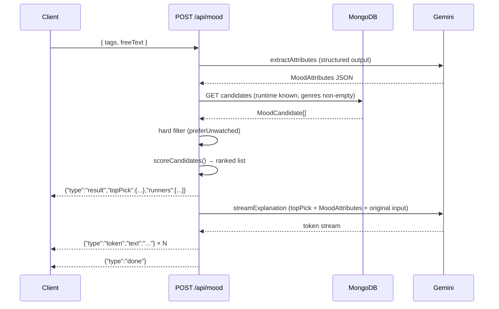

# 03 — Mood Engine

## Background

Collection core (01-collection-core.md) and collection intelligence
(02-collection-intelligence.md) are complete. Every Disc has `watched`,
`watchCount`, `lastWatchedAt`, `rating`. Every TMDBMovie has `genres`,
`runtime`, `directors`. A single `GET /api/stats` endpoint returns
`CollectionStats` for UI and AI consumption.

Mood engine is Phase 3 of the AI build order. It is the first feature
to use the Gemini API and to establish the `ai/prompts/` and
`ai/pipelines/` module patterns. Phase 4 (decision pipeline) will live
in the same "Watch" tab and consume the same candidate endpoint.

## Problem

The user owns a collection of discs but has no way to answer "what
should I watch right now?" based on their current mood. Browsing the
full collection is slow and requires knowing what you want before you
know what you want.

## Questions and Answers

**Q: What is a "mood" — free text, presets, or both?**
A: Both. Preset tags as fast path, free text as override/supplement.
Gemini interprets the combined input the same way.

**Q: What attributes does a mood map to?**
A: `MoodAttributes`: genre weights (Record<string, number>), runtime
preference ('short' | 'any' | 'long'), and rewatch preference
(preferUnwatched: boolean). Directors and tone keywords deferred to
Phase 4 where full decision context is available.

**Q: Genre weights or genre list?**
A: Weights (0–1 floats). An ordered list is implicit weights with less
information. Weights give the scoring function a continuous signal.

**Q: How does scoring work?**
A: `score = genreScore + runtimeBonus`. `genreScore` = sum of
`moodAttributes.genres[genre]` for each genre in disc.genres.
`runtimeBonus` = 0.5 if disc runtime fits `runtimePreference`, else 0.
`preferUnwatched` is a hard pre-filter, not a penalty.

**Q: What does the engine return?**
A: topPick (highest scored candidate) + up to 3 runners
(deterministic, no AI call) + streamed AI explanation for topPick only.

**Q: What is the candidate pool?**
A: All discs where runtime is known AND genres is non-empty. Hard filter:
if `preferUnwatched: true`, exclude watched discs entirely before
scoring. Never silently relax this filter.

**Q: What if fewer than 4 candidates exist?**
A: Return whatever is available. 0 candidates → empty state.
Runners are optional. Never silently relax `preferUnwatched`.

**Q: Where do AI calls run?**
A: Both server-side. GEMINI_API_KEY never touches the browser.
Explanation streamed Gemini → server → client via chunked transfer.

**Q: How many server endpoints?**
A: One. `POST /api/mood` runs the full pipeline and streams NDJSON.

**Q: What is the stream format?**
A: NDJSON with a `type` discriminator. Client uses plain `fetch()` +
`TextDecoder` loop.

**Q: How are errors handled?**
A: Graceful degradation per failure point. Gemini call 1 fails → HTTP 500. 0 candidates → `{"type":"empty"}`. Gemini call 2 fails → stream
topPick + runners without explanation + `{"type":"error","message":"..."}`.

**Q: What does the explanation prompt produce?**
A: 2–3 sentences, conversational tone, references the user's original
mood input ("you wanted something intense"), explains why the pick fits.
Written like a knowledgeable friend.

**Q: How is MoodAttributes extracted from Gemini?**
A: Structured output — `responseMimeType: "application/json"` +
`responseSchema`. No manual JSON parsing or fence-stripping.

**Q: What are the runtime thresholds?**
A: short < 100 min, long ≥ 150 min. Named constants in a shared config
file alongside `runtimeBonus = 0.5`.

**Q: Where does the Mood page live?**
A: New `/watch` route under a "Watch" tab. Tab bar: Collection | Watch.
Phase 4 decision pipeline will also live in this tab.

**Q: What is the UI flow?**
A: Two states — `idle` (input form with presets + free text) and
`result` (full-screen topPick + streamed explanation + runners).
"Try again" button resets to idle.

**Q: What preset tags are available?**
A: Locked set of 8: Intense · Chill · Dark · Uplifting · Quick Watch ·
Epic Night · Comfort Rewatch · Something New.

**Q: What gets tested?**
A: Unit tests for all pure functions (`scoreCandidates()`, runtime
threshold logic, client NDJSON stream parser). Pipeline functions tested
with Gemini mocked at the SDK boundary. No integration test.

## Design

### Types

```ts
// ai/types/mood.ts

interface MoodInput {
  tags: MoodTag[]
  freeText: string
}

type MoodTag =
  | 'Intense'
  | 'Chill'
  | 'Dark'
  | 'Uplifting'
  | 'Quick Watch'
  | 'Epic Night'
  | 'Comfort Rewatch'
  | 'Something New'

interface MoodAttributes {
  genres: Record<string, number> // genre name → weight 0–1
  runtimePreference: 'short' | 'any' | 'long'
  preferUnwatched: boolean
}

// src/types/mood.ts (frontend)

interface MoodCandidate {
  _id: string
  tmdbId: number
  title: string
  year: number
  posterUrl: string
  genres: string[]
  runtime: number
  directors: string[]
  watched: boolean
  watchCount: number
  lastWatchedAt: string | null
  rating: 1 | 2 | 3 | 4 | 5 | null
}

interface MoodResultFrame {
  type: 'result'
  topPick: MoodCandidate
  runners: MoodCandidate[]
}

interface MoodTokenFrame {
  type: 'token'
  text: string
}

interface MoodDoneFrame {
  type: 'done'
}

interface MoodEmptyFrame {
  type: 'empty'
}

interface MoodErrorFrame {
  type: 'error'
  message: string
}

type MoodStreamFrame =
  | MoodResultFrame
  | MoodTokenFrame
  | MoodDoneFrame
  | MoodEmptyFrame
  | MoodErrorFrame
```

### Scoring Constants

```ts
// ai/config.ts (or server/src/lib/moodConfig.ts)
export const RUNTIME_SHORT_MAX = 100 // minutes
export const RUNTIME_LONG_MIN = 150 // minutes
export const RUNTIME_BONUS = 0.5
```

### Pipeline Flow



### File Paths

| File                                      | Purpose                                                  |
| ----------------------------------------- | -------------------------------------------------------- |
| `ai/types/mood.ts`                        | `MoodInput`, `MoodAttributes`, `MoodTag`                 |
| `ai/prompts/extractMoodAttributes.ts`     | Typed prompt fn — structured output                      |
| `ai/prompts/streamMoodExplanation.ts`     | Typed prompt fn — streamed explanation                   |
| `ai/pipelines/moodPipeline.ts`            | Orchestrates both calls + scoring                        |
| `ai/config.ts`                            | `RUNTIME_SHORT_MAX`, `RUNTIME_LONG_MIN`, `RUNTIME_BONUS` |
| `server/src/services/candidateService.ts` | MongoDB join query for candidates                        |
| `server/src/routes/mood.ts`               | `POST /api/mood` — NDJSON stream                         |
| `server/src/routes/candidates.ts`         | `GET /api/discs/candidates`                              |
| `src/types/mood.ts`                       | Frontend types: `MoodCandidate`, stream frames           |
| `src/hooks/useMoodStream.ts`              | Fetch + TextDecoder loop, returns stream state           |
| `src/pages/WatchPage.tsx`                 | `/watch` route — idle/result two states                  |
| `src/components/MoodInput.tsx`            | Tag picker + free text input                             |
| `src/components/MoodResult.tsx`           | topPick + streamed explanation + runners                 |

### Chosen Approaches

✅ Preset tags + free text (hybrid input)
✅ Genre weights (not ordered list) — continuous scoring signal
✅ `preferUnwatched` as hard filter (not penalty) — respects user intent
✅ `runtimeBonus = 0.5` named constant — runtime is real signal, not tiebreaker
✅ Single `POST /api/mood` endpoint — server owns full pipeline
✅ NDJSON stream — plain fetch, no SSE infrastructure
✅ Structured output for attribute extraction — no JSON parsing fragility
✅ Graceful degradation per failure point
✅ "Watch" tab — correct abstraction for Phase 4 growth

❌ Genre list (ordered) — implicit weights with less precision
❌ `preferUnwatched` as penalty — violates user intent when high-genre match is watched
❌ Two endpoints (client orchestration) — puts AI pipeline logic in src/
❌ SSE — more infrastructure, no gain over NDJSON for this use case
❌ Client-side Gemini calls — exposes GEMINI_API_KEY in browser
❌ Tone keywords / directors in MoodAttributes — Phase 4 concern
❌ Integration test — flaky and costly; mocked SDK boundary is sufficient

## Implementation Plan

**Phase 1 — Candidate endpoint + scoring (no AI)**

- `candidateService.ts`: MongoDB join query, filter runtime+genres
- `GET /api/discs/candidates` route
- `ai/config.ts`: runtime constants + runtimeBonus
- `scoreCandidates()` pure function in `ai/pipelines/moodPipeline.ts`
- Unit tests for scoring + threshold logic
- Verify: hit the endpoint, get scored candidates back

**Phase 2 — Attribute extraction (Gemini call 1)**

- `extractMoodAttributes.ts` prompt with structured output
- Wire into pipeline: mood input → MoodAttributes → scored candidates
- Unit tests with Gemini mocked
- Verify: POST with tags+text, get ranked candidates back

**Phase 3 — Explanation streaming (Gemini call 2 + NDJSON)**

- `streamMoodExplanation.ts` prompt
- Full NDJSON stream from `POST /api/mood`
- Error handling per failure point
- Verify: full stream from POST to done frame

**Phase 4 — Client: WatchPage + useMoodStream**

- `useMoodStream.ts`: fetch + TextDecoder loop
- `WatchPage.tsx`: idle/result states
- `MoodInput.tsx`: tag picker + free text
- `MoodResult.tsx`: topPick card + streaming explanation + runners
- Add Watch tab to tab bar

## Trade-offs

**Easier:** Scoring is deterministic and fully testable. Structured
output eliminates prompt fragility for attribute extraction. Single
endpoint keeps AI pipeline orchestration server-side. "Watch" tab
is Phase 4-ready with no nav rework.

**Harder:** NDJSON stream requires careful frame ordering — result
frame must arrive before tokens so the UI can render the card
immediately. Error mid-stream (Gemini call 2) must not lose the
already-sent result frame.

**Out of scope:**

- Director/tone keyword attributes (Phase 4)
- Caching mood results (personal-scale, freshness preferred)
- Multiple top picks with individual explanations (cost + complexity)
- Relaxing `preferUnwatched` when pool is thin (violates user intent)
- TMDB filmography lookup for director completion
