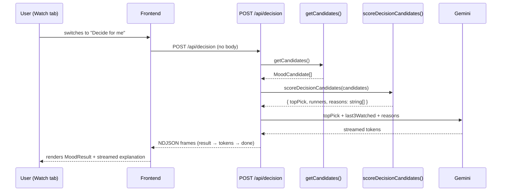

# 04 — Decision Pipeline

_Session date: 2026-04-01_

---

## Background

CineFlow's mood engine (Phase 3) requires the user to articulate their watch intent before producing a recommendation. The decision pipeline (Phase 4) is the autonomous counterpart: given the user's full collection state — watch history, ratings, variety patterns, and director completion — it recommends what to watch next without any mood input.

The pipeline lives in the same Watch tab (`/watch`) as the mood engine, surfaced through a mode toggle. The mood engine established all the key architectural patterns: typed Gemini prompts, deterministic scoring, NDJSON streaming, and `MoodCandidate` as the candidate shape. Phase 4 reuses all of these.

See `03-mood-engine.md` for the scoring and streaming foundations this builds on.

---

## Problem

The mood engine requires explicit user intent. Sometimes the user wants to be told what to watch — no mood input, no friction. The decision pipeline answers "just decide for me" by reasoning over the user's actual collection history and producing a single confident recommendation with a personalised explanation.

---

## Questions and Answers

**Q1 — Core problem statement**
What problem does the decision pipeline solve that the mood engine doesn't?

✅ The decision pipeline is "just decide for me" — autonomous recommendation from watch history, ratings, and collection patterns. No mood input required. The mood engine is explicit; the decision pipeline is autonomous.

---

**Q2 — UI coexistence with mood engine**
How do the two features share the Watch tab?

✅ Mode toggle at the top of the Watch tab: "Mood" vs "Decide for me". Only one mode is visible at a time. Both modes share the same result area.

❌ Stacked (both visible simultaneously) — creates ambiguity about what drove the result.
❌ Separate sections — unnecessary for two mutually exclusive modes.

---

**Q3 — Trigger**
Auto-run on mode switch or button press?

✅ Auto-run when the user switches to "Decide for me" — switching is the intent signal. On re-enter (navigation return), show the last cached result with a "Pick again" button. Do not auto-run on navigation return.

---

**Q4 — Ranking signals**

✅ Signal set:

- **Recency penalty** — soft deprioritisation based on whether a disc appears in the last 3 watched discs (adapts to watch cadence, not a fixed time window)
- **User rating** — prefer discs rated 4–5 stars; unrated discs are neutral
- **Variety** — deprioritise genres shared with the last 1–2 watched discs
- **Director completion** — boost a disc if the user has watched ≥50% of that director's collection but not this disc
- **Unwatched priority** — soft preference for unwatched; rewatches allowed if collection is mostly watched
- **tmdbRating** — final tiebreaker only; not a primary signal

❌ Cast signal — excluded. Directors are a stronger signal; cast adds noise and complexity.

---

**Q5 — Pipeline architecture**
Does Gemini rank candidates or only explain?

✅ Same architecture as mood engine: deterministic scoring function ranks all candidates → top pick + named scoring reasons passed to Gemini → Gemini streams the explanation only.

❌ AI-driven ranking — expensive, unpredictable, and untestable.

---

**Q6 — Output format**
New shape or reuse mood engine output?

✅ Same output shape: `topPick` + up to 3 `runners` + streamed explanation. Reuse `MoodCandidate` type and `MoodResult` component. No new frontend types needed for the result.

---

**Q7 — Gemini explanation context**
What does Gemini receive to write the explanation?

✅ Top pick metadata + last 3 watched discs (title, rating, watchCount) + named scoring reasons as `string[]`.

Named reasons are human-readable strings, not raw floats:

```
["director completion — 3 of 4 Villeneuve films watched", "not watched recently", "rated 5 stars"]
```

Gemini narrates _why_ the algorithm chose this pick in personal terms.

❌ Passing raw scores (e.g. `score: 2.3`) — not human-readable; Gemini produces better copy from narrative strings.
❌ Full collection stats — bloats the prompt with irrelevant data.

---

**Q8 — Backend endpoint**
New endpoint or extend existing?

✅ `POST /api/decision` — new independent endpoint. Same NDJSON stream format as `POST /api/mood`. Independently testable, separately evolvable.

❌ Branch inside `POST /api/mood` — couples two independent pipelines.

---

**Q9 — Scoring function input**
What data does the scoring function receive?

✅ The full candidates array from `getCandidates()`. All signals are derived internally:

- Last 3 watched: sort by `lastWatchedAt` desc, take 3
- Director completion: group candidates by director, count watched/total
- Variety: check genres of last 3 watched
- Rating/recency: read from each candidate's disc fields

No additional DB queries beyond the existing `getCandidates()` call.

---

**Q10 — Edge cases**
What happens when the pipeline can't produce a good recommendation?

✅ Only true empty state is zero candidates → `{"type":"empty"}`.
All other edge cases resolve through signal degradation: missing signals contribute zero, scoring always produces a ranked list. `tmdbRating` is the final tiebreaker, ensuring a stable result even with no user signals.

---

**Q11 — Result persistence**
Where is the last result stored?

✅ React state only. Lost on page refresh. Consistent with mood engine.

---

**Q12 — Mode toggle persistence**
Which mode is active on first load? Is mode remembered?

✅ "Mood" is default on first load. Mode not persisted — resets to Mood on refresh. React state only.

---

**Q13 — Scoring reason type**
Structured type or plain strings?

✅ `string[]` — human-readable strings destined for Gemini's prompt. Not programmatically consumed downstream.

---

## Design

### Data flow



### NDJSON frames (identical to mood engine)

```
{"type":"result","topPick":{...},"runners":[...]}
{"type":"token","text":"..."}
{"type":"done"}
{"type":"empty"}          // zero candidates only
{"type":"error","message":"..."}
```

### Scoring function signature

```typescript
// server/src/lib/scoreDecisionCandidates.ts
interface DecisionScore {
  topPick: MoodCandidate
  runners: MoodCandidate[]
  reasons: string[] // human-readable, passed to Gemini
  last3Watched: MoodCandidate[] // passed to Gemini for context
}

function scoreDecisionCandidates(
  candidates: MoodCandidate[],
): DecisionScore | null
// returns null only if candidates is empty
```

### Signal implementation sketch

```typescript
// 1. Last 3 watched — for recency + variety + Gemini context
const last3 = candidates
  .filter((c) => c.lastWatchedAt !== null)
  .sort((a, b) => b.lastWatchedAt!.localeCompare(a.lastWatchedAt!))
  .slice(0, 3)

// 2. Director completion — boost if ≥50% watched but this disc not watched
const directorGroups = groupBy(candidates, (c) => c.directors[0])
// boost = directorWatched / directorTotal >= 0.5 && !candidate.watched

// 3. Score per candidate
score += ratingBonus // +2 if rating 4-5, 0 otherwise
score += unwatchedBonus // +1 if !watched
score += directorBonus // +1 if director completion ≥50%
score -= recentPenalty // -2 if in last3Watched
score -= varietyPenalty // -1 per genre shared with last3Watched genres
// tiebreaker: tmdbRating (0–10, normalised)
```

### New files

| File                                        | Purpose                                         |
| ------------------------------------------- | ----------------------------------------------- |
| `server/src/lib/scoreDecisionCandidates.ts` | Pure scoring function — all signals             |
| `server/src/routes/decision.ts`             | `POST /api/decision` — NDJSON stream            |
| `ai/pipelines/decisionPipeline.ts`          | Orchestrates scoring + Gemini call              |
| `ai/prompts/streamDecisionExplanation.ts`   | Gemini prompt for decision explanation          |
| `src/hooks/useDecisionStream.ts`            | Fetch + NDJSON parser — mirrors `useMoodStream` |

### Modified files

| File                              | Change                                           |
| --------------------------------- | ------------------------------------------------ |
| `src/pages/WatchPage.tsx`         | Mode toggle, decision mode state, auto-run logic |
| `server/src/index.ts` (or router) | Mount `POST /api/decision`                       |

### Reused without modification

- `MoodCandidate` type (both `src/types/mood.ts` and `ai/types/mood.ts`)
- `MoodResult` component (`src/components/MoodResult.tsx`)
- `getCandidates()` service (`server/src/services/discService.ts`)

---

## Implementation Plan

**Phase 1 — Scoring function (pure, no AI)**

- Write `server/src/lib/scoreDecisionCandidates.ts`
- All signals: recency (last 3 watched), rating, unwatched priority, director completion, variety, tmdbRating tiebreaker
- Returns `null` on empty candidates; otherwise `{ topPick, runners, reasons, last3Watched }`
- Full unit test coverage before moving to Phase 2

**Phase 2 — Backend endpoint (no AI)**

- Write `server/src/routes/decision.ts`: `POST /api/decision`
- Calls `getCandidates()` → `scoreDecisionCandidates()` → streams `result` frame + `done` frame
- No Gemini call yet — stub explanation as empty string
- Mount route in server

**Phase 3 — Gemini explanation**

- Write `ai/prompts/streamDecisionExplanation.ts` — typed prompt receiving topPick, last3Watched, reasons
- Write `ai/pipelines/decisionPipeline.ts` — orchestrates scoring + streaming
- Wire into route: result frame first, then stream tokens, then done
- Unit test pipeline with Gemini mocked at SDK boundary

**Phase 4 — Frontend**

- Write `src/hooks/useDecisionStream.ts` — mirrors `useMoodStream`, same NDJSON parser
- Update `WatchPage.tsx`:
  - Mode toggle ("Mood" / "Decide for me"), React state, default Mood
  - Decision mode: auto-run on switch, cache result in state
  - Re-enter: show cached result + "Pick again" button, no auto-run
  - Empty/error states reuse existing patterns

---

## Trade-offs

**Made easier:**

- Reusing `MoodCandidate`, `MoodResult`, and NDJSON patterns keeps the implementation surface small
- Pure scoring function is fully testable without DB or AI
- Named reasons decouple scoring logic from prompt authoring

**Made harder:**

- Signal weighting is opinionated — no user control over which signals matter most. Acceptable for Phase 4; tuning is a future concern.
- Director completion uses only the first director in `TMDBMovie.directors` for simplicity. Co-directed films may score inconsistently.

**Explicitly out of scope:**

- Time-of-day or day-of-week signals — overengineering for a personal tool
- Session-level watch history — `lastWatchedAt` and `watchCount` on Disc are sufficient
- User-configurable signal weights
- Persisting the last decision result across page refreshes
